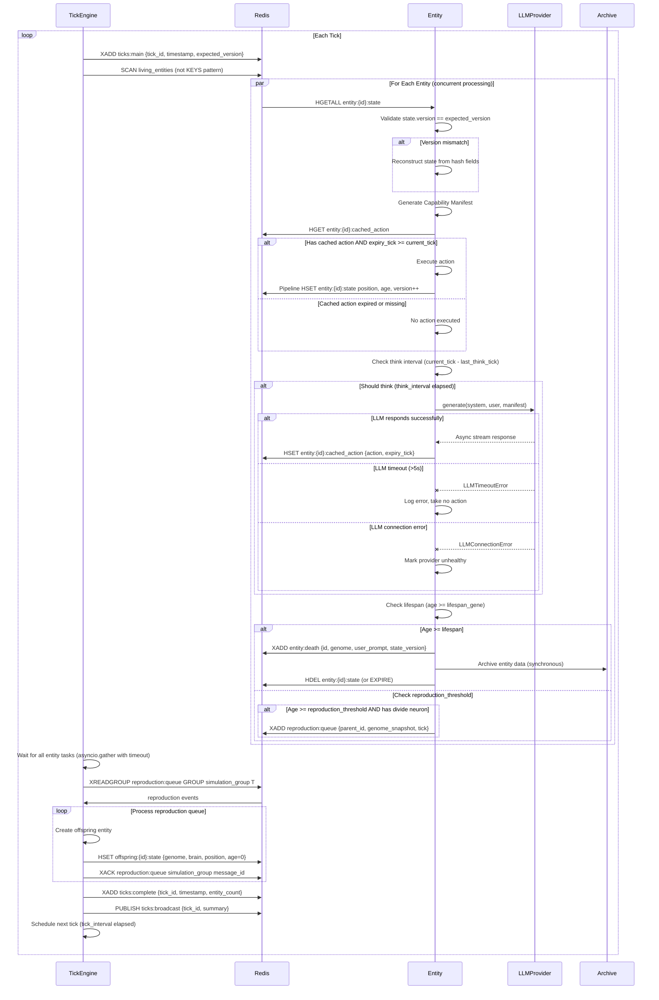

# AGI Entity Simulation V1 - Core Implementation

## Overview

Build the foundational architecture for an AGI (Agent-driven Genetic-simulated Individual-organisms) simulation system. The system simulates individual entities with three interacting layers: genetic (heritable traits, mutation, evolution), neural (capability gating), and agent (LLM-driven reasoning). This V1 implementation establishes the core loop proving all three layers interact correctly and can produce diverging individual histories.

## Problem Frame

We need to create a simulation where entities:
1. **Evolve genetically** - inherit and mutate traits across generations
2. **Perceive/act through neural capabilities** - their brain configuration determines what they can sense and do
3. **Decide via LLM reasoning** - make choices constrained by their neural capability manifest

The challenge is building a hybrid tick system where world state advances synchronously while LLM calls happen asynchronously, with proper capability gating and clean modular boundaries.

## Requirements Trace

| Requirement | Description | Implementation Unit |
|-------------|-------------|---------------------|
| R1-R4 | Hybrid tick mode, async LLM caching, lifespan, think interval | Unit 3, Unit 6 |
| R5-R9 | Neuron pool, brain wiring, Capability Manifest | Unit 2, Unit 6 |
| R10-R16 | Prompt system, multi-provider LLM, model assignment | Unit 4, Unit 6 |
| R17-R23 | Gene pool, genomes, reproduction (asexual V1) | Unit 1, Unit 6 |
| R24-R27 | Void environment, entity interactions | Unit 5, Unit 6 |
| R28-R30 | Storage abstraction, Redis runtime, archive | Unit 7 |
| R31-R34 | Service architecture, async throughout, module interfaces | Units 1-7 |

## Scope Boundaries

**In Scope:**
- Asexual reproduction (division) with forward-compatible interface for sexual reproduction
- Void environment (no terrain, resources, or survival pressure)
- V1 neuron types: proximity, signal-receiver, locomotion, signal-emitter, divide, memory-cell
- V1 gene types: lifespan, brain-size, neuron-affinity, personality-seed, think-interval, reproduction-threshold
- Four LLM providers: Ollama, LM Studio, OpenRouter, Anthropic Claude
- Basic UI: entity list, tick counter, per-entity state view

**Out of Scope:**
- Sexual reproduction (interface ready, not implemented)
- Vector database, embeddings
- Terrain, resources, hazards, survival pressure
- Directed messaging (broadcast-only in V1)
- Authentication or multi-user support
- Complex UI beyond basic state viewing

## Context & Research

### Technology Stack

| Component | Choice | Version | Rationale |
|-----------|--------|---------|-----------|
| Python | Primary language | 3.12+ | Modern async support, type hints |
| FastAPI | API service | 0.135.x | Async-native, excellent ecosystem |
| Quart | Web service | 0.20.x | Flask-compatible, async-native |
| Hypercorn | ASGI server | 0.17.3 | Recommended for Quart |
| redis-py | Redis client | 5.x | Full async Streams support |
| Pydantic | Schema validation | 2.x | Type-safe, JSON Schema export |
| anthropic | Claude SDK | 0.49.0+ | ACP support |
| openai | OpenAI SDK | 1.68.0+ | OpenRouter compatibility |
| ollama | Local models | 0.6.1 | Async client available |

### Key Technical Decisions

1. **Interface Pattern**: Use `typing.Protocol` over ABCs for module boundaries
   - *Rationale*: More flexible for async, allows duck typing, easier for future Rust extensions
   - *Reference*: Research findings show Protocols work better with async/await patterns

2. **Redis Data Structure**: Hash per entity for state, Redis Streams for tick coordination
   - *Rationale*: Atomic updates for entity state, ordered log for tick distribution
   - *Reference*: See external research on Redis Streams patterns

3. **LLM Provider Interface**: Native SDKs with unified Protocol, not LiteLLM
   - *Rationale*: More control over async patterns, cleaner capability manifest integration
   - *Alternative considered*: LiteLLM - rejected for finer control over hybrid tick model

4. **Capability Manifest Schema**: Pydantic v2 models with `extra="allow"`
   - *Rationale*: Type-safe with extensibility for future neuron types
   - *Schema version*: 1.0

5. **Archive Trigger**: Synchronous at entity death
   - *Rationale*: Entity death is deterministic; synchronous archiving simplifies state management
   - *Deferred to V2*: Background job option if archive latency impacts tick performance

### Existing Infrastructure

- Model provider configurations already exist in `.claude/settings.*.json`
- Git repository initialized with v0.0.1 tag
- Comprehensive requirements document already written
- No existing code - greenfield implementation

## Key Technical Decisions

| Decision | Rationale | From Origin |
|----------|-----------|-------------|
| Hybrid tick model | Synchronous world state + async LLM calls balances determinism with latency | R1-R2 |
| Protocol over ABC | Better async support, duck typing for future extensions | R33 |
| Redis Streams for coordination | Already required for state, reduces infrastructure complexity | R28, R32 |
| Hash-per-entity in Redis | Atomic field updates, efficient partial reads | Deferred question |
| Synchronous archiving | Death is deterministic; simpler state management | Deferred question |
| Void environment V1 | Minimal complexity, focus on layer interactions | R24-R27 |
| Parent1 + optional Parent2 interface | Forward-compatible for sexual reproduction V2 | R20 |

## Open Questions

### Resolved During Planning

| Question | Resolution |
|----------|------------|
| ABC vs Protocol for interfaces | Use `typing.Protocol` - better async support |
| Redis data structure | Hash per entity for state, Streams for ticks |
| Archive trigger | Synchronous at death (can optimize later if needed) |
| Model assignment strategy | Random from available pool (configurable per-run) |
| Capability Manifest schema | Pydantic v2 models with `extra="allow"` for extensibility |
| Prompt template format | Jinja2 for system prompts, plain text for user prompt updates |

### Deferred to Implementation

| Question | Why Deferred |
|----------|--------------|
| Exact LLM output schema | Depends on testing with actual models; start with simple JSON |
| Optimal think interval defaults | Requires runtime testing with different model latencies |
| Redis connection pooling strategy | Implementation detail that can be tuned once core works |
| Archive storage format (JSON vs MessagePack) | Benchmark once archive volume known |

## High-Level Technical Design

> *This illustrates the intended approach and is directional guidance for review, not implementation specification. The implementing agent should treat it as context, not code to reproduce.*

### Service Architecture

```
┌─────────────────────────────────────────────────────────────────┐
│                         Redis                                   │
│  ┌──────────────┐  ┌──────────────┐  ┌──────────────┐         │
│  │ Entity State │  │ Tick Stream  │  │ Command Pub  │         │
│  │ (Hash: hset) │  │ (XADD/XREAD) │  │ (PUBLISH)    │         │
│  └──────────────┘  └──────────────┘  └──────────────┘         │
└─────────────────────────────────────────────────────────────────┘
         ▲                      ▲                      ▲
         │                      │                      │
┌────────┴──────┐      ┌────────┴──────┐      ┌────────┴──────┐
│  API Service  │      │ Simulation  │      │  Web Service  │
│   (FastAPI)     │◄────►│   Engine    │      │   (Quart)     │
│                 │      │             │      │               │
│ • Gene Pool     │      │ • Tick Loop │      │ • UI Routes   │
│ • Neuron Pool   │      │ • LLM Cache │      │ • WebSocket   │
│ • Entity Archive│      │ • Reproduction│    │   Streaming   │
└─────────────────┘      └─────────────┘      └───────────────┘
```

### Module Interfaces

```python
# genetics/protocol.py
from typing import Protocol, runtime_checkable
from dataclasses import dataclass

@runtime_checkable
class Gene(Protocol):
    """Gene Protocol - maps to Pydantic model fields in implementation"""
    name: str  # Instance attribute from Pydantic Field
    value: float
    dominance: float  # For V2 sexual reproduction; unused in V1 asexual
    mutation_rate: float

    def mutate(self) -> "Gene": ...

@runtime_checkable
class Genome(Protocol):
    """Genome Protocol - collection of genes"""
    genes: dict[str, Gene]

    def reproduce(self, parent2: "Genome | None" = None) -> "Genome":
        """
        Create offspring genome.
        - V1: parent2 is None (asexual); returns mutated copy of parent1
        - V2: parent2 may be provided; uses dominance-based gene selection
        """
        ...

# neural/protocol.py
@runtime_checkable
class Neuron(Protocol):
    """Neuron Protocol - individual neuron in brain"""
    neuron_type: str  # "sensory", "motor", "reproductive", "interneuron"
    name: str
    activation: float

    def compute(self, inputs: dict) -> float:
        """Compute activation based on input signals"""
        ...

class CapabilityManifest(Protocol):
    """
    Capability Manifest Protocol - neural/agent interface.
    Implemented as Pydantic model with extra='allow' for extensibility.
    See High-Level Technical Design section for full schema.
    """
    schema_version: str
    agent_id: str
    tick: int
    perception: dict
    actions: dict
    memory: dict

@runtime_checkable
class Brain(Protocol):
    """Brain Protocol - neural network for entity"""
    neurons: list[Neuron]
    edges: list[tuple[str, str, float]]  # (from_neuron, to_neuron, weight)

    def generate_manifest(self, context: dict) -> CapabilityManifest:
        """
        Generate Capability Manifest for current tick.
        Context includes: entity_id, tick, nearby_entities, received_messages
        """
        ...

# agents/protocol.py
from typing import AsyncGenerator
from dataclasses import dataclass

class LLMError(Exception):
    """Base for LLM provider errors"""
    pass

class LLMTimeoutError(LLMError):
    """Raised when LLM response exceeds timeout"""
    pass

class LLMConnectionError(LLMError):
    """Raised when connection to provider fails"""
    pass

class LLMRateLimitError(LLMError):
    """Raised when rate limit exceeded; includes retry_after hint"""
    retry_after: int

@runtime_checkable
class LLMProvider(Protocol):
    """
    LLM Provider Protocol - unified interface for all model providers.

    Raises:
        LLMTimeoutError: When response exceeds configured timeout
        LLMConnectionError: When provider is unreachable
        LLMRateLimitError: When rate limit exceeded (check retry_after)
    """
    name: str

    async def generate(
        self,
        model: str,
        system_prompt: str,
        user_prompt: str,
        manifest: CapabilityManifest
    ) -> AsyncGenerator[str, None]:
        """
        Stream LLM response tokens.

        Yields text chunks as they arrive from the provider.
        Raises LLMError subclasses on failure.
        """
        ...

    async def check_available(self) -> bool:
        """Health check - return True if provider reachable and operational"""
        ...

    @property
    def available_models(self) -> list[str]:
        """List of models this provider can serve"""
        ...
```

### Tick Flow



### Capability Manifest Structure

```json
{
  "schema_version": "1.0",
  "agent_id": "entity-uuid",
  "tick": 42,
  "perception": {
    "proximity": {
      "available": true,
      "activation": 0.85,
      "detected_entities": [
        {"id": "entity-2", "distance": 5.2, "direction": "north"}
      ]
    },
    "signal_receiver": {
      "available": true,
      "activation": 0.3,
      "recent_messages": [
        {"from": "entity-3", "content": "hello", "ticks_ago": 1}
      ]
    }
  },
  "actions": {
    "locomotion": {
      "available": true,
      "activation": 0.9,
      "parameters": {"direction": "string", "distance": "number"}
    },
    "signal_emitter": {
      "available": true,
      "activation": 0.7,
      "parameters": {"message": "string", "radius": "number"}
    },
    "divide": {
      "available": false,
      "activation": 0.0,
      "reason": "reproduction_threshold not met (age 5 < 20)"
    }
  },
  "memory": {
    "available": true,
    "cells": 3,
    "values": [0.5, 0.2, 0.8]
  }
}
```

**Pydantic Schema Definition:**

```python
# Directional guidance: Pydantic v2 models with extensibility via extra="allow"
# This schema is the sole interface between neural layer and agent layer

class DetectedEntity(BaseModel):
    model_config = ConfigDict(extra="allow")
    id: str
    distance: float
    direction: Literal["north", "south", "east", "west"]

class ProximityPerception(BaseModel):
    model_config = ConfigDict(extra="allow")
    available: bool
    activation: float = Field(ge=0.0, le=1.0)
    detected_entities: list[DetectedEntity] = []

class SignalMessage(BaseModel):
    model_config = ConfigDict(extra="allow")
    from_entity: str
    content: str
    ticks_ago: int = Field(ge=0)

class SignalReceiverPerception(BaseModel):
    model_config = ConfigDict(extra="allow")
    available: bool
    activation: float = Field(ge=0.0, le=1.0)
    recent_messages: list[SignalMessage] = []

class ActionParameter(BaseModel):
    model_config = ConfigDict(extra="allow")
    type: str
    enum: list[str] | None = None  # For constrained values like direction
    minimum: float | None = None
    maximum: float | None = None

class ActionCapability(BaseModel):
    model_config = ConfigDict(extra="allow")
    available: bool
    activation: float = Field(ge=0.0, le=1.0)
    reason: str | None = None  # Human-readable explanation when unavailable
    parameters: dict[str, ActionParameter] | None = None

class MemoryState(BaseModel):
    model_config = ConfigDict(extra="allow")
    available: bool
    cells: int = Field(ge=0)
    values: list[float] = []

class CapabilityManifest(BaseModel):
    model_config = ConfigDict(extra="allow")
    schema_version: Literal["1.0"] = "1.0"
    agent_id: str
    tick: int = Field(ge=0)
    perception: dict[str, ProximityPerception | SignalReceiverPerception] = {}
    actions: dict[str, ActionCapability] = {}
    memory: MemoryState = Field(default_factory=lambda: MemoryState(available=False))

    def get_available_actions(self) -> list[str]:
        return [name for name, action in self.actions.items() if action.available]
```

## Implementation Snapshot (2026-04-07)

**Code-complete units** (committed via `07dcd67` → `b7b1531`): all 7 units have source files written.

**Blocking issue — dev environment not set up:**
- `pydantic`, `fastapi`, and all core deps are missing from the active Python environment
- Tests cannot import even at conftest level until `pip install -e ".[dev]"` is run
- This must be the **first action** before any test verification

**Untracked files that must be staged and committed:**
- `genetics/gene_pool.py`, `genetics/genome.py`, `genetics/protocols.py` (new)
- `genetics/__init__.py`, `genetics/reproduction.py` (modified)
- `tests/conftest.py` (modified)
- `requirements.txt` (new)

**Corrupted filename requiring investigation:**
- `agents/providers/C\357\200\272UsersiuriDownloadscvsc2agentsprovidersprovider.py` — the `\357\200\272` sequence is the UTF-8 encoding of the Unicode fullwidth colon `：` (U+FF1A), likely a path-confusion artifact. This file needs to be inspected and if valid, moved to `agents/providers/provider.py`.

**File structure deviations from plan** (actual vs. planned):
- Tests are flat `tests/test_*.py` (not subdirectories like `tests/genetics/`, `tests/neural/`)
- Entity code is in `simulation/entity.py` + `simulation/factory.py` (not a separate `entity/` module)
- Neural: no separate `neuron_protocol.py` or `capability_manifest.py` — absorbed into `neural/models.py`
- `agents/providers/provider.py` exists alongside individual provider files
- Missing: `.env.example`, `docker-compose.yml`, `data/prompts/system_template.j2`

**ce:work action order:**
1. Install dev environment: `pip install -e ".[dev]"`
2. Fix/remove corrupted provider file
3. Stage and commit untracked genetics files and modified files
4. Run `pytest` and fix any remaining test failures
5. Create missing config/template files (`.env.example`, `docker-compose.yml`, `data/prompts/system_template.j2`)

---

## Implementation Units

- [ ] **Unit 1: Project Structure & Genetic Layer**

**Goal:** Establish Python project structure and implement the genetic algorithm foundation (gene pool, genomes, asexual reproduction).

**Requirements:** R17-R23, R33

**Dependencies:** None

**Files:**
- Create: `pyproject.toml`, `requirements.txt`, `.env.example`
- Create: `genetics/__init__.py`, `genetics/protocols.py` (Gene, Genome Protocols)
- Create: `genetics/gene_pool.py`, `genetics/genome.py`, `genetics/reproduction.py`
- Create: `data/gene_pool.json` (V1 gene definitions)
- Create: `tests/genetics/test_gene_pool.py`, `tests/genetics/test_reproduction.py`, `tests/genetics/test_mutation.py`

**Approach:**
- Use Pydantic v2 models for gene definitions (JSON-serializable)
- Implement gene pool as JSON file loaded at startup
- Gene instances carry dominance values even though V1 only uses asexual reproduction
- Reproduction interface accepts `parent1` and optional `parent2` for V2 compatibility
- Per-gene mutation applied stochastically based on `mutation_rate`

**Execution note:** Test-first for mutation logic and inheritance patterns.

**Technical design:**
```python
# Directional guidance for gene mutation
# Each gene mutates independently with probability = mutation_rate
# Mutation amount = random.gauss(0, mutation_std) where std is gene-specific

# Reproduction flow
# 1. Copy parent1 genome
# 2. For each gene, apply mutation with probability mutation_rate
# 3. Return new genome with mutated values
# 4. (V2) If parent2 present, apply dominance-based selection
```

**Patterns to follow:**
- Use `Protocol` for Gene interface
- Store gene pool as `data/gene_pool.json` (read-only at runtime)
- Follow Pydantic v2 patterns for validation

**Test scenarios:**
- Gene mutation produces different values with appropriate distribution
- Asexual reproduction creates copy with potential mutations
- Reproduction interface accepts None for parent2 without error
- Gene pool loads correctly from JSON file

**Verification:**
- `pytest tests/genetics/` passes
- Gene mutations produce statistically expected distribution
- Genome reproduction preserves all gene types

---

- [ ] **Unit 2: Neural Layer & Capability Manifest**

**Goal:** Implement the neural system with universal neuron pool, brain wiring, and Capability Manifest generation.

**Requirements:** R5-R9, R33

**Dependencies:** Unit 1 (complete)

**Files:**
- Create: `neural/__init__.py`, `neural/neuron_protocol.py`, `neural/neuron_pool.py`
- Create: `neural/brain.py`, `neural/capability_manifest.py`
- Create: `data/neuron_pool.json`
- Create: `tests/neural/test_brain.py`, `tests/neural/test_capability_manifest.py`

**Approach:**
- Neuron pool is a fixed JSON catalog (like gene pool)
- Brain is a subset of neurons with weighted directed edges
- Capability Manifest is the sole neural/agent interface (Pydantic models)
- V1 neurons: proximity, signal-receiver, locomotion, signal-emitter, divide, memory-cell
- Brain configuration influenced by genome (brain-size gene, neuron-affinity gene)

**Execution note:** Test-first for manifest generation and brain wiring.

**Technical design:**
```python
# Directional guidance for brain construction from genome
# 1. Read brain-size gene value -> N neurons to select
# 2. Read neuron-affinity gene -> bias vector for neuron type selection
# 3. Sample N neurons from pool with affinity weighting
# 4. Generate random directed edges between neurons (sparse connectivity)
# 5. Weight edges randomly (can be negative for inhibition)

# Directional guidance for Capability Manifest generation
# 1. For each sensory neuron: populate "perception" section
# 2. For each motor neuron: populate "actions" section
# 3. For reproductive neuron: populate based on threshold gene
# 4. For memory cells: populate "memory" section
# 5. Activation weights computed from brain state
```

**Patterns to follow:**
- Pydantic v2 for Capability Manifest schema with `extra="allow"`
- Use `Protocol` for Neuron interface
- Neuron pool JSON structure matches gene pool pattern

**Test scenarios:**
- Brain generates manifest with correct `available` per neuron based on wiring
- Proximity neuron includes detected entities within range (exact distance calculation)
- Signal receiver includes messages from last 5 ticks with sender IDs
- Action `available: false` includes human-readable `reason` field
- Manifest validates against Pydantic v2 schema with `extra="allow"`
- Brain with 6 neurons generates manifest with 6 capabilities; brain with 3 neurons generates 3
- Activation weights are floats in range [0.0, 1.0] computed from neuron state

**Verification:**
- `pytest tests/neural/` passes with >90% coverage
- Capability Manifest JSON schema exports valid OpenAPI spec
- Different brain configurations produce meaningfully different manifests (diff >50% of fields)

---

- [ ] **Unit 3: Simulation Engine Core**

**Goal:** Implement the hybrid tick engine with Redis Streams coordination and entity lifecycle management.

**Requirements:** R1-R4, R32, R33, R34

**Dependencies:** Unit 1, Unit 2, Unit 4 (complete) - Unit 4 needed for meaningful async LLM integration testing

**Files:**
- Create: `simulation/__init__.py`, `simulation/tick_engine.py`
- Create: `simulation/entity_lifecycle.py`, `simulation/action_resolver.py`
- Create: `tests/simulation/test_tick_engine.py`, `tests/simulation/test_lifecycle.py`

**Approach:**
- Tick engine uses Redis Streams for tick distribution (`ticks:main` stream)
- Each tick: publish to stream, process all living entities
- Hybrid model: sync tick boundaries, async LLM calls between ticks
- Entity state stored in Redis hash (`entity:{id}:state`)
- Cached actions stored with expiry tick (`entity:{id}:cached_action`)
- Think interval checked per entity before dispatching LLM call

**Execution note:** Test-first for tick ordering and entity lifecycle state transitions.

**Technical design:**
```python
# Directional guidance for tick flow
# 1. TickEngine publishes tick to ticks:main stream (XADD)
# 2. TickEngine reads all living entities from Redis (keys pattern)
# 3. For each entity:
#    a. Load state from Redis hash
#    b. Check for cached action, execute if present and valid
#    c. Update position if locomotion executed
#    d. Check age against lifespan gene
#    e. If should think (think interval elapsed): dispatch async LLM call
#    f. If death: publish to entity:death stream, archive
#    g. If reproduce: publish to reproduction:queue
# 4. Process reproduction queue (create offspring)
# 5. Wait for async LLM calls to complete (with timeout)
# 6. Cache LLM outputs for next tick

# Directional guidance for action resolution
# Actions validated against Capability Manifest before execution
# Invalid actions (not in manifest) are silently rejected
# Valid actions modify entity state or environment
```

**Patterns to follow:**
- Use `asyncio.gather()` for concurrent entity processing
- Redis Streams with consumer groups for potential horizontal scaling
- Always acknowledge messages with XACK

**Test scenarios:**
- Ticks increment sequentially: tick N+1 follows tick N with no gaps or duplicates
- Entity ages correctly: entity with age 5 at tick 42 has age 6 at tick 43
- Think interval: entity with `think_interval=5` calls LLM at ticks 0, 5, 10 (not 0, 1, 2)
- Cached actions: action cached at tick N executes at tick N+1, expires at tick N+expiry
- LLM timeout: entity takes no action if LLM response exceeds 5s timeout
- Partial tick completion: if 3 of 10 entities timeout, remaining 7 complete tick normally
- Lifespan expiry: entity with `lifespan=50` dies at tick 50, not tick 49 or 51
- Invalid action rejection: LLM returns `{"action": "fly"}` but entity lacks flight neuron → silently ignored
- Reproduction queue: parent at tick 20 queues reproduction, offspring created at tick 21 with parent genome snapshot
- Tick rate: simulation maintains >10 ticks/sec with 50 concurrent entities and mocked LLM

**Verification:**
- `pytest tests/simulation/` passes with >90% coverage
- Integration test: full tick cycle with 5 entities completes in <1 second
- Stress test: 1000 ticks with 50 entities completes without memory leaks

---

- [ ] **Unit 4: Multi-Provider LLM Interface**

**Goal:** Implement unified LLM provider interface supporting Ollama, LM Studio, OpenRouter, and Anthropic Claude with async streaming.

**Requirements:** R14-R16, R33, R34

**Dependencies:** Unit 2 (Capability Manifest schema needed)

**Files:**
- Create: `agents/__init__.py`, `agents/provider_protocol.py`
- Create: `agents/providers/ollama_client.py`, `agents/providers/lmstudio_client.py`
- Create: `agents/providers/openrouter_client.py`, `agents/providers/anthropic_client.py`
- Create: `agents/model_manager.py`
- Create: `tests/agents/test_providers.py`, `tests/agents/test_model_manager.py`

**Approach:**
- Use `Protocol` for provider interface with async streaming
- Each provider is a separate module with native SDK
- Model manager handles runtime discovery and assignment
- V1 default: random assignment from available pool
- Configuration from environment (`.env` for API keys)

**Execution note:** Test-first with mocked provider responses; integration tests can use actual Ollama if available.

**Technical design:**
```python
# Directional guidance for provider interface
# Each provider implements:
# - async def generate(messages, model, **kwargs) -> AsyncGenerator[str, None]
# - async def check_available() -> bool  # health check
# - @property def available_models() -> list[str]

# Directional guidance for model assignment
# 1. At simulation start, query each provider for available models
# 2. Build pool of (provider_name, model_name) tuples
# 3. On entity birth, randomly select from pool
# 4. Store assignment in entity state

# Directional guidance for prompt construction
# System prompt + User prompt + Capability Manifest (as JSON) + History
# Output: structured JSON with action and optional user_prompt_update
```

**Patterns to follow:**
- Native SDKs (anthropic, openai, ollama) not LiteLLM
- Async streaming throughout (AsyncGenerator)
- Environment-based configuration (python-dotenv)

**Test scenarios:**
- Provider streaming: Ollama streams 100 tokens over 2 seconds; Anthropic streams 100 tokens over 3 seconds
- Model discovery: Ollama reports ["llama3.2", "mistral"]; Anthropic reports ["claude-3-5-sonnet-latest"]
- Random assignment: across 100 entities, distribution is ±20% from mean for each available provider
- Health check: returns False for Ollama when `localhost:11434` unreachable; returns False for Anthropic with invalid API key
- Provider failure: when Ollama unavailable, entities assigned to Ollama fail over to OpenRouter or stall gracefully
- Rate limiting: OpenRouter returns 429 with Retry-After header → provider backs off for specified duration
- Prompt injection: Capability Manifest appears as JSON block between `### CAPABILITIES ###` delimiters
- Output parsing: valid JSON `{"action": {"type": "locomotion", "direction": "north"}}` parsed correctly
- Output validation: malformed JSON (missing brace) → logged, entity takes no action
- Streaming interruption: connection dropped after 50 tokens → partial response cached, not executed

**Verification:**
- `pytest tests/agents/` passes with >90% coverage
- Integration tests for 2+ providers (Ollama + Anthropic mocked)
- Provider failure scenarios tested with mock responses

---

- [ ] **Unit 5: Environment System**

**Goal:** Implement the void environment with entity positions, movement, proximity detection, and broadcast messaging.

**Requirements:** R24-R27, R33

**Dependencies:** Unit 3 (complete)

**Files:**
- Create: `environment/__init__.py`, `environment/world.py`, `environment/spatial.py`
- Create: `environment/interactions.py`
- Create: `tests/environment/test_world.py`, `tests/environment/test_spatial.py`

**Approach:**
- Void is a bounded coordinate space (2D for V1)
- Entity positions stored in Redis (part of entity hash)
- Proximity detection queries spatial index (Redis Geo or simple distance calc)
- Broadcast messages go to all entities within radius
- No terrain, resources, or survival pressure

**Execution note:** Test-first for spatial calculations and message broadcasting.

**Technical design:**
```python
# Directional guidance for spatial indexing
# Option A: Redis Geo (if using Redis >= 3.2 with geo support)
#   - GEOADD for entity positions
#   - GEORADIUS for proximity detection
# Option B: Simple distance calculation (for simplicity V1)
#   - Store x,y in entity hash
#   - Iterate all entities and compute distance
#   - Accept O(n) for V1 given expected entity counts

# Directional guidance for broadcast messaging
# 1. Signal emitter action includes message and radius
# 2. Environment queries entities within radius
# 3. For each recipient: update their signal-receiver neuron state
# 4. Message available to recipient in next tick's Capability Manifest
```

**Patterns to follow:**
- Abstract Environment interface (Protocol) for future terrain
- Separate spatial calculations from world state management

**Test scenarios:**
- Entity movement updates position correctly
- Proximity detection finds entities within range
- Broadcast messages reach only entities within radius
- Out-of-bounds movement is handled (clamp or wrap)
- Spatial queries are efficient for expected entity counts

**Verification:**
- `pytest tests/environment/` passes
- Entities can move and detect each other
- Messages propagate correctly through environment

---

- [ ] **Unit 6: Prompt System & Entity Assembly**

**Goal:** Implement the complete prompt system with system/user prompts and assemble all layers into functioning entities.

**Requirements:** R10-R13, R33

**Dependencies:** Unit 2 (brain), Unit 4 (providers), Unit 5 (environment)

**Files:**
- Create: `agents/prompt_builder.py`, `agents/response_parser.py`
- Create: `data/prompts/system_template.j2`, `data/personality_seeds/`
- Create: `entity/__init__.py`, `entity/entity.py`
- Create: `tests/agents/test_prompts.py`, `tests/entity/test_entity.py`

**Approach:**
- System prompt generated at birth from genome (personality-seed gene)
- User prompt starts empty or seeded from parent
- Prompt template uses Jinja2 for variable substitution
- LLM output is JSON with `action` and optional `user_prompt_update`
- Entity coordinates all three layers (genetic, neural, agent)

**Execution note:** Test-first for prompt construction and response parsing.

**Technical design:**
```python
# Directional guidance for system prompt generation
# 1. Load base template from data/prompts/system_template.j2
# 2. Apply personality-seed gene influence (personality traits)
# 3. Include fixed constraints (cannot modify system prompt, etc.)
# 4. (V2) Blend with parent system prompt for inheritance

# Directional guidance for user prompt updates
# LLM can return: {"action": {...}, "reflection": "...", "user_prompt_update": "..."}
# Update applied to user prompt (appended or replaced based on strategy)
# Archive user prompt on death for offspring inheritance

# Directional guidance for entity assembly
# Entity class coordinates:
# - Genome (from genetics layer)
# - Brain (from neural layer, configured by genome)
# - Provider/model assignment (from agents layer)
# - Position and state (from environment layer)
# - Tick lifecycle (from simulation layer)
```

**Patterns to follow:**
- Jinja2 for templating (separate templates from code)
- JSON Schema validation for LLM output
- Entity is the composition root for all three layers

**Test scenarios:**
- System prompt includes personality seed influence
- Capability Manifest injected into prompt correctly
- LLM response parsed into valid action structure
- User prompt updates applied correctly
- Entity assembly creates complete entity from genome

**Verification:**
- `pytest tests/agents/test_prompts.py` passes
- `pytest tests/entity/test_entity.py` passes
- Prompt includes all required context

---

- [ ] **Unit 7a: Storage Abstraction**

**Goal:** Implement repository interfaces and Redis/archive implementations.

**Requirements:** R28-R30, R33

**Dependencies:** Unit 1-6 (complete)

**Files:**
- Create: `storage/__init__.py`, `storage/repository_protocol.py`
- Create: `storage/redis_repository.py` (entity state, streams), `storage/archive_repository.py`
- Create: `storage/transaction.py` (Redis pipeline/Lua script helpers)
- Create: `tests/storage/test_redis.py`, `tests/storage/test_archive.py`, `tests/storage/test_transactions.py`

**Approach:**
- Repository Protocol abstracts storage operations (get, save, delete, list_living, archive)
- Redis implementation uses hash-per-entity with multi-field atomic updates via pipelines
- Transaction helper ensures atomic multi-field updates (state version + fields)
- Archive implementation writes to JSON files (V1), PostgreSQL-ready for V2
- Redis Streams use XADD with MAXLEN to prevent unbounded growth

**Execution note:** Test-first for transaction atomicity and stream operations.

**Technical design:**
```python
# Directional guidance for atomic state updates
# Use Redis pipeline or Lua script for:
#   HSET entity:{id}:state field1 value1 field2 value2 ...
#   HINCR entity:{id}:state version 1
# This ensures entity state is always consistent

# Directional guidance for stream management
# XADD ticks:main MAXLEN ~10000 * tick_id N timestamp T
# Trim to ~10k entries to control memory

# Directional guidance for consumer groups
# XGROUP CREATE ticks:main simulation_group $ MKSTREAM
# XREADGROUP GROUP simulation_group worker1 STREAMS ticks:main >
# Always XACK after processing
```

**Patterns to follow:**
- Protocol-based abstraction for swappable implementations
- Connection pooling via redis-py asyncio (default pool)
- SCAN instead of KEYS for listing entities (avoids blocking)

**Test scenarios:**
- Atomic update: position and age updated together; partial read never sees inconsistent state
- Stream trim: after 10,001 ticks, stream contains ~10,000 entries
- Consumer group: message processed exactly once even with multiple workers
- PEL reclaim: idle message (>30s) reclaimed by another consumer via XCLAIM
- Archive write: entity data written to `archive/{entity_id}_{tick}.json` on death
- Connection failure: exponential backoff (100ms, 200ms, 400ms, max 5 retries)

**Verification:**
- `pytest tests/storage/` passes with >90% coverage
- Atomic operations verified with concurrent access tests
- Memory usage stable under 100MB for 1000 entities over 1000 ticks

---

- [ ] **Unit 7b: API Service (FastAPI)**

**Goal:** Implement FastAPI service for management API.

**Requirements:** R31, R33

**Dependencies:** Unit 7a (complete)

**Files:**
- Create: `api/__init__.py`, `api/main.py`, `api/dependencies.py`
- Create: `api/routes/entities.py`, `api/routes/pools.py`, `api/routes/simulation.py`
- Create: `api/lifespan.py` (Redis connection management)
- Create: `tests/api/test_entities.py`, `tests/api/test_pools.py`, `tests/api/test_simulation.py`

**Approach:**
- FastAPI with lifespan context managers for Redis connection startup/shutdown
- Dependency injection for repository instances
- Routes: entities (CRUD), pools (gene/neuron read-only), simulation (start/stop/status)
- Async endpoints throughout (no blocking calls)

**Execution note:** Test-first for endpoint contracts, then integration tests.

**Technical design:**
```python
# Directional guidance for lifespan management
# @asynccontextmanager
# async def lifespan(app: FastAPI):
#     app.state.redis = await redis.from_url(REDIS_URL)
#     yield
#     await app.state.redis.close()

# Directional guidance for endpoints
# GET /entities/{id} -> EntityState from Redis
# GET /gene-pool -> Load from data/gene_pool.json
# POST /simulation/start -> Publish to simulation:commands stream
```

**Patterns to follow:**
- FastAPI native async patterns with lifespan
- Pydantic models for request/response validation
- HTTP status codes: 200 success, 404 not found, 503 Redis unavailable

**Test scenarios:**
- GET /entities/{id}: returns 200 with entity state, 404 if entity not found
- GET /gene-pool: returns JSON matching data/gene_pool.json exactly
- POST /simulation/start: publishes `{"action": "start"}` to simulation:commands stream
- Redis unavailable: returns 503 with retry-after header
- Concurrent requests: 100 simultaneous requests handled without blocking

**Verification:**
- `pytest tests/api/` passes with >90% coverage
- API starts and responds to requests in <1 second
- Load test: 100 concurrent requests, <5% error rate

---

- [ ] **Unit 7c: Web Service (Quart) & WebSocket Streaming**

**Goal:** Implement Quart service for UI and real-time WebSocket streaming.

**Requirements:** R31, R33

**Dependencies:** Unit 7a, Unit 7b (complete)

**Files:**
- Create: `web/__init__.py`, `web/main.py`, `web/websocket.py`
- Create: `web/routes/ui.py` (HTML templates), `web/templates/index.html`
- Create: `web/static/` (CSS/JS for basic UI)
- Create: `config.py` (Pydantic Settings), `docker-compose.yml`
- Create: `tests/web/test_websocket.py`, `tests/web/test_ui.py`

**Approach:**
- Quart with before_serving/after_serving hooks for Redis subscription
- WebSocket endpoint `/ws/ticks` streams live simulation state
- UI: basic HTML showing entity list, tick counter, per-entity state
- Static files served via Quart
- Configuration via Pydantic Settings (environment + .env)

**Execution note:** Test-first for WebSocket message flow, then integration with UI.

**Technical design:**
```python
# Directional guidance for WebSocket streaming
# @app.websocket("/ws/ticks")
# async def tick_stream():
#     await websocket.accept()
#     pubsub = redis_client.pubsub()
#     await pubsub.subscribe("ticks:broadcast")
#     try:
#         async for message in pubsub.listen():
#             if message["type"] == "message":
#                 await websocket.send(message["data"])
#     finally:
#         await pubsub.unsubscribe()

# Directional guidance for tick broadcasting
# TickEngine publishes to Redis pub/sub channel after each tick
# Web service subscribes and broadcasts to all WebSocket connections
```

**Patterns to follow:**
- Quart native async patterns with before_serving/after_serving
- Jinja2 templates for HTML rendering
- Connection cleanup via try/finally (handles disconnections)

**Test scenarios:**
- WebSocket connection: client receives tick updates within 100ms of tick completion
- Multiple clients: 10 simultaneous WebSocket connections all receive same tick data
- Disconnection: abrupt client disconnect handled gracefully, no server errors
- UI rendering: GET / returns HTML with entity list populated from API
- Proxy to API: web service forwards `/api/*` requests to FastAPI service
- Static files: CSS/JS served with correct MIME types

**Verification:**
- `pytest tests/web/` passes with >90% coverage
- WebSocket test: connect, receive 5 ticks, disconnect cleanly
- UI loads in browser and displays entity data within 2 seconds

---

## System-Wide Impact

**Interaction Graph:**
- TickEngine → Redis Streams → Entity processing → LLM Provider → Action resolution
- API Service → Redis → Entity state queries
- Web Service → WebSocket → Browser UI
- Reproduction → Genetic Layer → New Entity creation
- Death → Archive → Persistent storage

**Error Propagation:**

*LLM Provider Failures:*
- Single provider timeout: Entity takes no action that tick; retries next think interval
- Partial provider pool failure: Entities assigned to failed providers stall; healthy providers continue
- Provider rate limiting (429): Per-provider retry queue with exponential backoff
- Streaming interruption: Partial response cached but not executed; full response required
- Invalid LLM output (malformed JSON): Logged, entity takes no action; valid JSON required

*Redis Failures:*
- Connection loss: Simulation pauses; exponential backoff retry (100ms, 200ms, 400ms, max 5 attempts)
- Timeout on read: Entity skipped that tick; retry next tick
- Stream consumer crash: Pending entries reclaimed by other consumers after 30s idle

*Cross-Entity Failures:*
- Entity A failure does not affect Entity B's cached action validity
- Signal broadcast from failed entity: Not emitted (action never executed)
- Proximity detection: Failed entities may appear in proximity (state readable) but take no actions

**State Lifecycle Risks:**

*Redis Multi-Field Atomicity:*
- Risk: Multiple HSET commands for different fields are NOT atomic together
- Mitigation: Use Redis pipelines or Lua scripts for atomic multi-field updates (position + age + version)
- State versioning: Each update increments version field; reads validate expected version

*Stream-Hash Synchronization:*
- Risk: Tick stream and entity hash may be out of sync (tick N published but hash shows N-1)
- Mitigation: Tick entries include expected state version; entities validate version matches before action execution
- Version mismatch triggers state reconstruction from hash fields

*Cross-Stream Consistency:*
- Risk: Death/reproduction/reproduction:queue streams may process out of order
- Mitigation: Events include state version snapshots; orphaned offspring detection verifies parent exists
- Death before reproduction: Offspring still created from reproduction snapshot if parent dies same tick

*Consumer Group Management:*
- Risk: Pending entries never acknowledged (consumer crash), causing memory growth
- Mitigation: PEL monitoring with alerts when pending count exceeds threshold; idle entry reclaim via XCLAIM
- Dead letter stream: After 3 failed processing attempts, move entry to DLQ for manual inspection

*Async Context Loss:*
- Risk: LLM response arrives after entity death/reproduction
- Mitigation:
  - Response for dead entity: Discarded, logged as orphan
  - Response for reproduced entity: Associated with parent genetic lineage
  - Stale response (entity state changed): Re-validated against current capability manifest

**Cross-Layer Consistency:**

*Genetic/Neural/Agent Synchronization:*
- Brain wired once at birth from genome; immutable for lifespan (V1 simplification)
- Capability Manifest includes schema version hash; LLM must respond to specific version
- Action validation: LLM output checked against manifest before execution; invalid actions silently rejected
- User prompt update atomic with action execution: both succeed or both fail (no partial updates)

*Tick Coordination Failures:*
- Partial tick completion: Entities without LLM responses use cached actions or no-op; tick completes
- Timeout handling: Per-entity 5s timeout; after which entity no-ops for remainder of tick
- Stalled tick: If >50% entities timeout, pause simulation and alert operators

**Integration Coverage:**
- Tick engine + Redis + Entity + LLM (integration test with mocked LLM)
- Reproduction + Genetic + Neural (integration test: parent → offspring with mutation)
- API + WebSocket + Redis (integration test: tick streamed to browser within 100ms)
- Multi-provider: Ollama + Anthropic simultaneously (integration test)
- Failure recovery: Provider failure + recovery + entity reassignment (integration test)

## Risks & Dependencies

### Technical Risks

| Risk | Severity | Mitigation |
|------|----------|------------|
| LLM latency variance breaking tick timing | HIGH | Hybrid tick model with async caching; per-entity 5s timeout; partial tick completion |
| Multi-provider failure cascades | HIGH | Provider health checks; per-provider retry queues; graceful degradation per entity |
| Redis memory exhaustion from unbounded streams | HIGH | MAXLEN ~10k on XADD; stream trimming; PEL monitoring |
| Redis multi-field atomicity violations | MEDIUM | Pipeline/Lua script for atomic updates; state versioning for validation |
| Async context loss (LLM response arrives after entity death) | MEDIUM | Orphan response detection; genetic lineage tracking for reproduction |
| Cross-layer desynchronization (genetic/neural/agent) | MEDIUM | Immutable brain after birth; manifest version hashing; action validation |
| Consumer group message loss | MEDIUM | XACK after processing; PEL reclaim after 30s idle; dead letter queue after 3 failures |
| Archive performance impacting tick rate | LOW | Synchronous initially; monitor latency; background job if >100ms |
| Provider output format variance | MEDIUM | JSON Schema validation; fallback to no-action on parse failure |
| Tick engine stalls (>50% entities timeout) | MEDIUM | Stall detection; simulation pause; operator alert |

### Provider-Specific Risks

| Provider | Failure Mode | Detection | Mitigation |
|----------|--------------|-----------|------------|
| Ollama | Model unloading delay | Latency >2s | Warm-up ping; timeout fallback |
| Ollama | Local GPU OOM | Connection refused | CPU-only fallback mode |
| OpenRouter | Rate limit (429) | HTTP status | Retry-After header; exponential backoff |
| OpenRouter | Model unavailable | 404 response | Alternative model selection |
| Anthropic | Context length exceeded | Token counting | Pre-flight truncation |
| Anthropic | Content filtering | Response code | Graceful rejection handling |
| LM Studio | Server not running | Connection refused | Health check with 30s backoff |

### External Dependencies

**Required Infrastructure:**
- Redis 7.0+ (local or remote) - must be running before simulation start
- Docker (optional) - for Redis containerization
- Python 3.12+

**Provider Dependencies (at least one required):**
- Ollama - local, TCP on port 11434
- LM Studio - local, TCP (configurable port)
- OpenRouter - remote, API key in `.env`
- Anthropic Claude - remote, API key in `.env`

**Configuration Files:**
- `.env` - API keys and provider settings (see `.env.example`)
- `data/gene_pool.json` - V1 gene definitions (read-only at runtime)
- `data/neuron_pool.json` - V1 neuron definitions (read-only at runtime)
- `data/prompts/system_template.j2` - System prompt template

**Startup Sequence:**
1. Redis available and accepting connections
2. At least one LLM provider operational
3. Configuration files present and valid
4. API service starts (FastAPI on port 8000)
5. Web service starts (Quart on port 5000)
6. Simulation engine starts (background process via Redis)

## Documentation / Operational Notes

**Setup Instructions:**
1. Install Python 3.12+
2. Copy `.env.example` to `.env` and configure providers
3. Run `docker-compose up -d redis`
4. Start Ollama/LM Studio (if using local models)
5. Run `pip install -e .`
6. Run `python -m api.main` and `python -m web.main` in separate terminals
7. Access UI at `http://localhost:5000`

**Monitoring:**
- Redis memory usage (alert at >80% or >1GB)
- LLM call latency per provider (p50, p95, p99; alert if p95 >5s)
- Tick rate (alert if <5 ticks/sec for >10s)
- Entity count over time (unexpected growth indicates reproduction bug)
- PEL (pending entry list) size per consumer group (alert if >100)
- Provider health status (alert on any provider failure)
- Archive write latency (alert if >100ms)
- WebSocket connection count and message throughput

**Troubleshooting:**
- *Simulation won't start*: Check Redis connection; verify at least one provider healthy
- *Tick rate too low*: Check LLM provider latency; consider increasing think_interval
- *Redis memory growing*: Verify stream trimming (MAXLEN); check PEL for unacknowledged messages
- *Entities not responding*: Check provider health; verify Capability Manifest includes expected actions
- *WebSocket not streaming*: Check Redis pub/sub subscription; verify web service Redis connection

## Sources & References

- **Origin document:** [docs/brainstorms/2026-03-26-agi-entity-simulation-requirements.md](docs/brainstorms/2026-03-26-agi-entity-simulation-requirements.md)
- **Redis Streams patterns:** Research findings on XADD/XREADGROUP
- **FastAPI/Quart:** Official documentation for async patterns
- **Anthropic ACP:** https://github.com/zed-industries/claude-agent-acp (community project)
